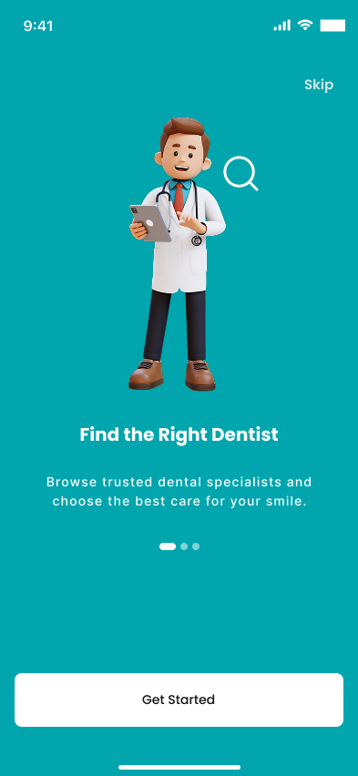
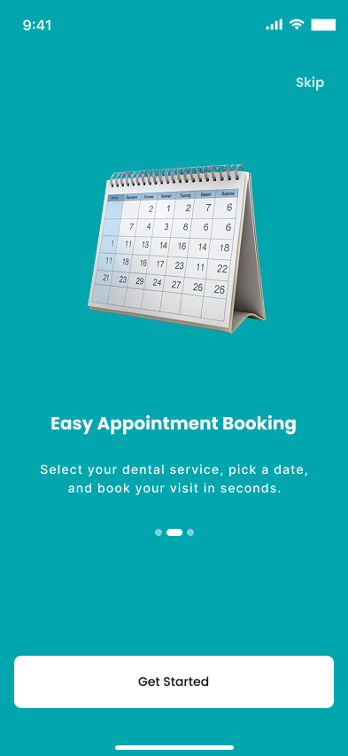
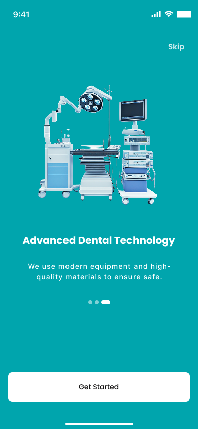
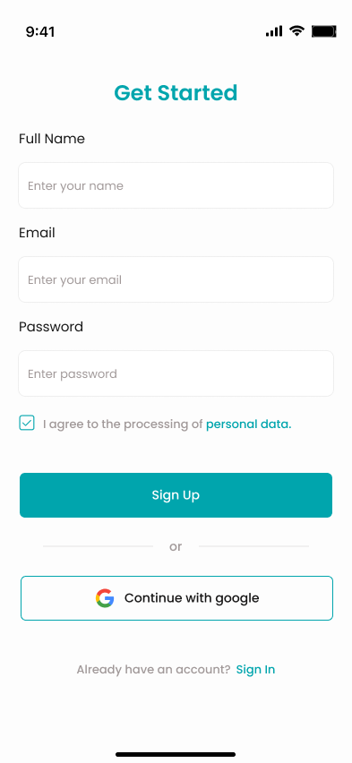
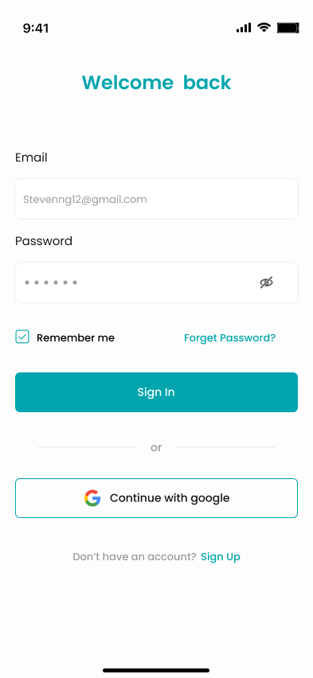
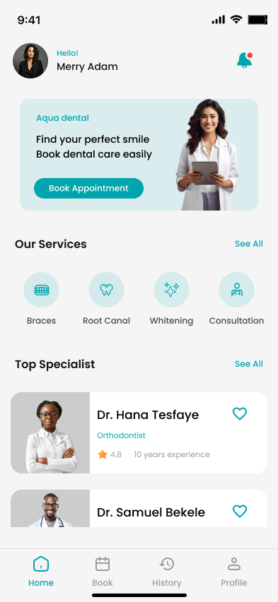
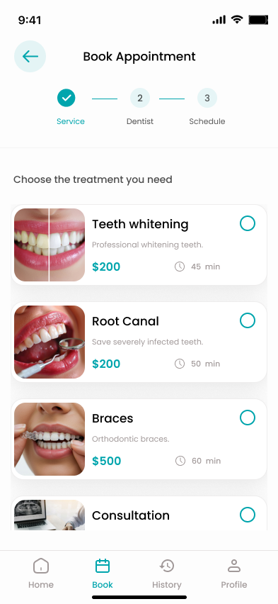
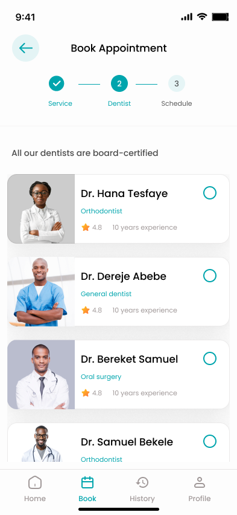
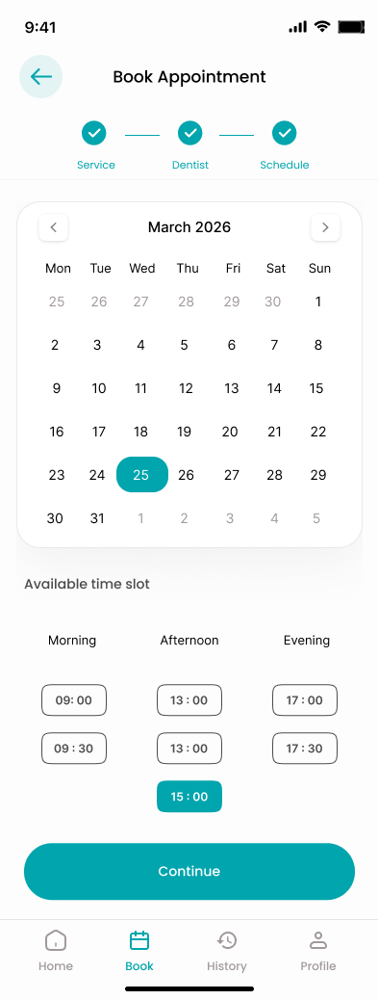

# FUTURE_UX_02
Appointment booking app for Aqua dental clinic , Ethiopia

### Project Overview

This project focuses on designing a mobile-first appointment booking app for Aqua dental clinic.

The goal is to create a simple, intuitive, and user-friendly mobile app that allows patients to easily book dental appointments, manage bookings, and receive confirmations.This is designed as a real-world solution for a local dental clinic.

## 1. Target Users

The app is designed for:

✔ Adults booking dental checkups

✔ Parents scheduling appointments for children

✔ Returning patients managing follow-ups

✔ Busy professionals needing quick appointment booking

✔ The design prioritizes speed, clarity, and ease of use.

## 2. User Problem

Currently, appointments are managed through:

  ✔ Phone calls

  ✔ WhatsApp messages

  ✔ Manual booking

This causes:

 ✔ Missed calls

 ✔ Double bookings

 ✔ Poor scheduling experience

The app solves these problems by providing a digital, structured booking system.

## 3. Key Screens Designed

👉 Onboarding / Welcome Screen

👉 Login / Sign Up

👉 Service Selection (Root canal, Braces, Whitening, Consultation, etc.)

👉 Dentist Selection

👉 Date & Time Slot Selection

👉 Appointment Confirmation Screen

👉 Booking History

👉 Notification

The app is designed mobile-first with clear touch-friendly interactions.

## 4. UX Decisions

🔲 Simple 4-step booking flow (Service → Dentist → Time → Confirm)

🔲 Large tap targets for accessibility

🔲 Clean dental-themed color palette (blue & white for trust)

🔲 Progress indicator during booking

🔲 Instant confirmation screen to reduce anxiety

🔲 Booking history for easy tracking

The design focuses on reducing friction and making booking fast.

## 5. How the Design Improves User Experience

The redesigned system improves user experience by:

✔ Reducing booking time to under 2 minutes

✔ Eliminating phone dependency

✔ Preventing double bookings

✔ Providing instant confirmation

✔ Allowing patients to track appointments easily

The solution increases efficiency for both patients and clinic staff.

 ## 🖼️ Design Screenshots

 ###  Onboarding Screens
 

 <table>
  <tr>
    <td valign="top">
      
    </td>
    <td valign="top">
      
    </td>
        <td valign="top">
      
    </td>
        <td valign="top">
      
    </td>
  </tr>
 </table>

 ###  Sign-in and Sign-up Screens 

<table>
  <tr>
    <td valign="top">
      
    </td>
    <td valign="top">
      
    </td>
     
  </tr>
 </table>

 
 ###  Home ,service ,dentist and date & time selection Screens 

  <table>
  <tr>
    <td valign="top">
      
    </td>
    <td valign="top">
      
    </td>
        <td valign="top">
      
    </td>
        <td valign="top">
      
    </td>
  </tr>
 </table>
 
